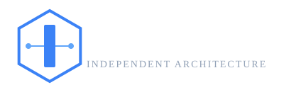

# IATest (Independent Architecture Test)

  
   
  
  
  
  

  

    <b></b>
  

## **About**

## **Core Modules**

## **Integration and Requirements**

## **License**

Licensed under the Apache License, Version 2.0. See LICENSE for details.
